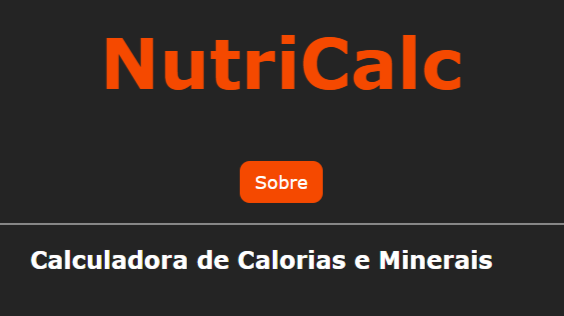

# NutriCalc

O **NutriCalc** é uma aplicação simples em HTML, CSS e JavaScript que permite calcular os **macronutrientes** e **micronutrientes** de uma refeição com base nos alimentos e quantidades informadas pelo usuário.

---

## Funcionalidades

- Cálculo de **calorias**, **proteínas**, **carboidratos** e **lipídios**.
- Cálculo de **fibras**, **cálcio**, **zinco** e **tiamina**.
- Interface intuitiva para entrada dos alimentos e suas quantidades.
- Página "Sobre" explicando o projeto.
- 100% desenvolvido com **HTML, CSS e JavaScript puro** (sem frameworks).

---

## Demonstração

🔗 **[Acesse o NutriCalc aqui](https://joaovitor045.github.io/NutriCalc/)**

 

---

## Estrutura do projeto

```plaintext
NutriCalc/
│
├── index.html          # Página principal da calculadora
├── sobre.html          # Página sobre o projeto
├── script.js           # Lógica do cálculo dos nutrientes
├── css/
│   ├── calculadora.css # Estilo da página principal
│   └── sobre.css       # Estilo da página sobre
└── imgs/
    └── Unb.jpg         # Imagem utilizada no projeto
